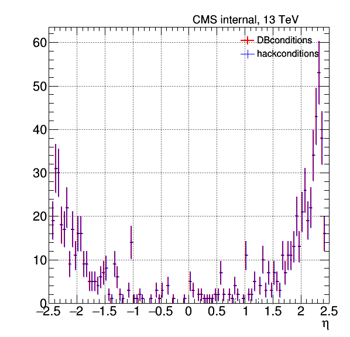
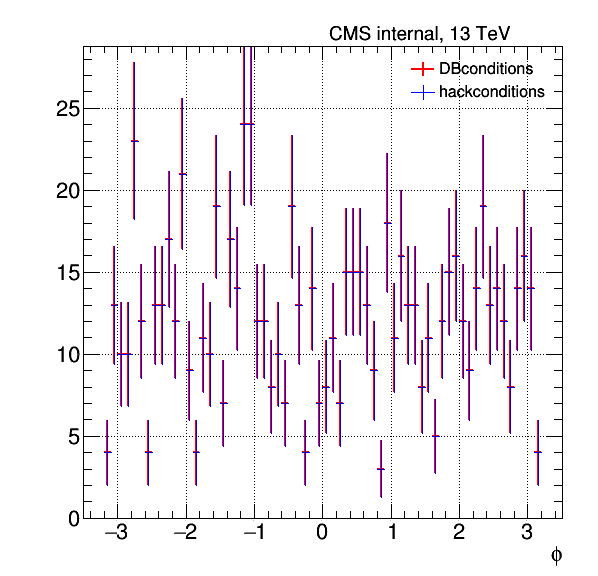
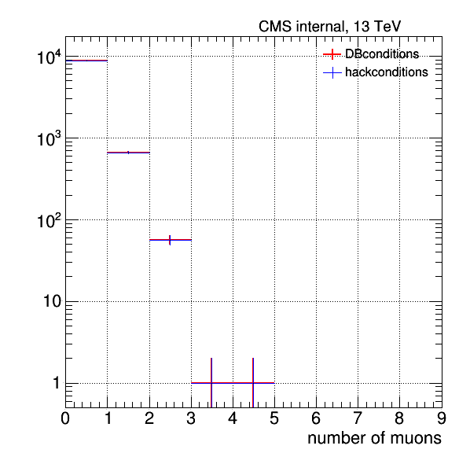
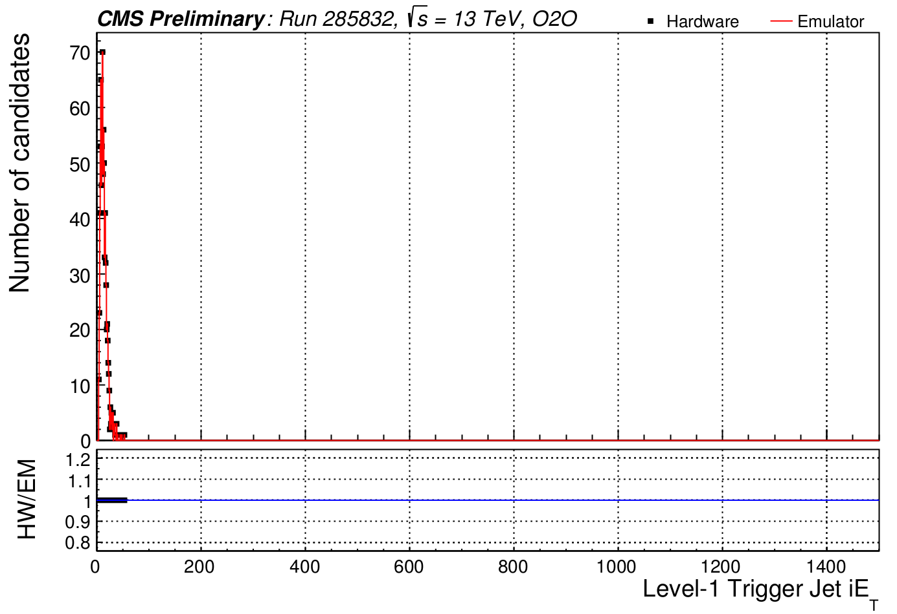

---
title       : "L1T O2O status"
subtitle    : 
author      : Khristian Kotov
job         : 
framework   : io2012        # {io2012, html5slides, shower, dzslides, ...}
highlighter : highlight.js  # {highlight.js, prettify, highlight}
hitheme     : tomorrow      # 
github:
  user: kkotov 
  repo: talks
url:
  lib:    ../../../../monohiggs/plots/libraries
  assets: ../../../../monohiggs/plots/assets
widgets     : [mathjax]     # {mathjax, quiz, bootstrap}
mode        : selfcontained # {standalone, draft}

--- &twocol

## L1T O2O tags in Run II

Following O2O tags need to be added to the data Global Tags for DQM:

*** =left

System     |   Payload[Tag Suffix]
-----------|-----------------
uGT        | L1TUtmTriggerMenu[_Stage2v0_hlt]
uGT RS     | L1TGlobalPrescalesVetos[_Stage2v0_hlt]
CALOL{1,2} | L1TCaloParams[_Stage2v1_hlt]
uGMT       | L1TMuonGlobalParams[_Stage2v0_hlt]

*** =right

System     |   Payload[Tag Suffix]
-----------|-----------------
BMTF       | L1TMuonBarrelParams[_Stage2v0_hlt]
OMTF       | L1TMuonOverlapParams[_Stage2v0_hlt]
EMTF       | L1TMuonEndCapParams[_Stage2v0_hlt]
O2O        | L1TriggerKey(List)[_Stage2v0_hlt]

*** =fullwidth

New&nbsp;L1TMuonEndCapForests[_Stage2v0_hlt] will be used with new EMTF emulator (in progress)

* History for these tags was reconstructed starting ~June 2016 (e.g. [last report](http://kkotov.github.io/l1o2o/talks/2017.03.20) for CaloParams)

* Validation (data-emulator comparison) was ran on a Heavy Ion run ([muons](https://its.cern.ch/jira/browse/CMSLITDPG-3), [calo](https://its.cern.ch/jira/browse/CMSLITDPG-4))

* Future Monte Carlo tags will be generated from these O2O tags and used in MC campaigns

---  &twocol

## Validation plots for muon tags

uGMT, BMTF, OMTF, and EMTF payloads demonstrate perfect agreement in run #285832:

*** =left

*** =right

---  &twocol

## Validation plots for CaloParams tag

CaloL{1,2} payload demonstrate perfect agreement in run #285832:

*** =left

*** =right

--- .class #id

## Summary

We close the chapter on L1T configuration in 2016; TSG is welcome to use tags within a data GTs

DQM needs a data GT for the real-time trigger validation with L1T emulators
